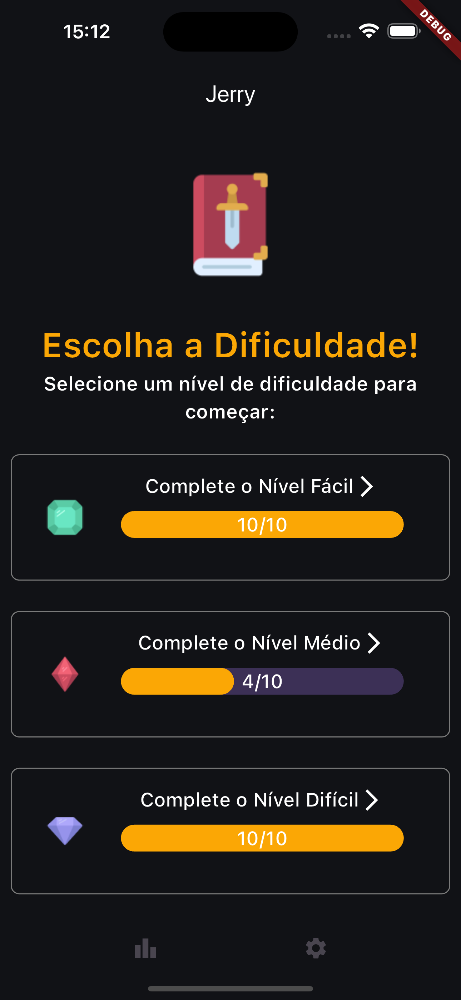

# Jerry

Projeto flutter para disciplina de matemática discreta

## Início

Essa aplicação estará disponível somente para Android em formato APK

Para a execução do projeto do início é necesseária ter o Flutter 3.15.9 na máquina com todas as configurações iniciais feitas. um tutorial pode ser encontrado [aqui](https://docs.flutter.dev/get-started/codelab)

## Instalação sem o Flutter

Caso queira é possivel baixar o APK em [Releases](https://github.com/Vet0r/jogo-tabela-verdade/releases) para Android

Não é possível rodar o app em iOS

## O Projeto

### Regras do jogo 
As regras são bem simples, o usuário escolhe uma dificuldade e responde as perguntas que aparecem

- O tempo inicial é 15 segundos.
- Ao acertar é somado 1, 3 ou 5 segundos dependendo da dificuldade.
- O multiplicador de pontos por difuculdade é de 1, 3 e 5, ou seja: um ponto no fácil vale 1, um ponto no difícil vale 5.
- O ranking lista jogadores por nivel de dificuldade.

### Imagens
    Tela inicial

    Gameplay

